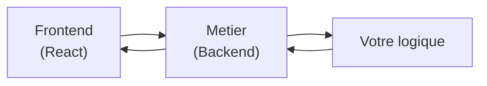

# OLGA METIER

## ⚠️ Mise en garde importante

Pour un fonctionnement maximal de cette application, il est nécessaire de lancer le backend à l'aide de `docker-compose`. Vous pouvez retrouver les fichiers nécessaires au lancement du backend à l'adresse suivante :

👉 [https://github.com/NEXUS-AI-Innovation-lab/olga-designer-admin-backend](https://github.com/NEXUS-AI-Innovation-lab/olga-designer-admin-backend)

Assurez-vous que le backend est bien démarré avant d'utiliser cette application frontend.

**Le moteur de workflow qui libère les équipes métier de l'infrastructure**

OLGA METIER est une **boîte d'exécution de workflows métier** qui permet aux équipes de se concentrer UNIQUEMENT sur leur logique applicative. Plus besoin de perdre du temps sur l'infrastructure, la persistence ou la gestion d'état.

## Ce que fait OLGA METIER

1. **Lance des instances de workflow** à la demande (`/startTask`)
2. **Interprète les étapes** définies par votre logique métier
3. **Sauvegarde automatiquement** les réponses et les états d'avancement
4. **Gère la persistence** de chaque instance et leur cycle de vie
5. **Maintient le contexte** entre les différentes étapes d'un workflow

## Architecture

OLGA METIER expose une API REST simple qui permet d'intégrer vos workflows dans n'importe quelle interface :



Note : Le code backend (OLGA-METIER-2) n'est pas accessible - c'est une boîte noire qui exécute vos workflows. Vous interagissez avec lui uniquement via son API.

## Démarrage rapide

### Installation

```bash
# Cloner le repository
git clone https://github.com/NEXUS-AI-Innovation-lab/olga-metier
cd OLGA-METIER-2

# Installer les dépendances
npm install

# Lancer le frontend
npm run dev
```

### Configuration

Créez un fichier `.env` à la racine :

```env
VITE_BACKEND_URL=http://localhost:9091
```

## API Endpoints

### Démarrer une nouvelle tâche

```
GET /startTask?inventory_id={id}&email={email}
```

Lance une nouvelle instance de workflow pour l'inventaire spécifié.

### Passer à l'étape suivante

```
POST /next?task_id={id}&email={email}
Body: { ... données du formulaire ... }
```

Soumet les données de l'étape courante et passe à la suivante.

### Voir l'état d'une tâche

```
GET /status?task_id={id}
```

Récupère l'état actuel et le formulaire d'une tâche en cours.

### Lister les tâches disponibles

```
GET /ongoingUser?email={email}
```

Récupère toutes les tâches en cours pour un utilisateur.

### Lister les inventaires disponibles

```
GET /getAllInventoriesForUser?email={email}
```

Récupère tous les inventaires accessibles à l'utilisateur.

## Interface utilisateur

Le frontend propose une interface intuitive organisée en 3 colonnes :

- **Lancer une demande** : les inventaires sur lesquels l'utilisateur peut initier un workflow
- **Demande à prendre** : les tâches disponibles en attente de traitement
- **Demandes démarrées** : les tâches déjà initiées par l'utilisateur

### Exemple d'utilisation (médical)

```jsx
// Démarrer une nouvelle tâche (prise de rendez-vous)
const handleStartTask = async () => {
  const res = await fetch(`${BACKEND_URL}/startTask?inventory_id=test&email=${email}`);
  const json = await res.json();
  
  // Le formulaire de saisie est automatiquement généré
  setForm(FormSchema.parse(json.form));
  setTaskId(json.task_id);
};
```

## Réutiliser FormInterpreter dans un autre projet

Le composant `FormInterpreter` peut être intégré dans n'importe quel projet React pour interpréter et afficher des formulaires dynamiques générés par l'API OLGA METIER.

### Installation dans un autre projet

1. **Copier le module** dans votre projet :

```bash
cp -r src/components/formInterpreter votre-projet/src/components/
```

1. **Installer les dépendances requises** (si pas déjà présentes) :

```bash
# React et TypeScript (obligatoires)
npm install react react-dom
npm install --save-dev typescript

# Dépendances optionnelles selon votre usage
npm install zod axios
```

### Utilisation basique

```jsx
import FormInterpreter from './components/formInterpreter';

function MonAppli() {
  const [formData, setFormData] = useState(null);
  const [taskId, setTaskId] = useState(null);

  // 1. Récupérer le formulaire depuis l'API OLGA METIER
  const startTask = async () => {
    const res = await fetch(
      `${BACKEND_URL}/startTask?inventory_id=monInventaire&email=user@example.com`
    );
    const json = await res.json();
    
    setFormData(json.form);
    setTaskId(json.task_id);
  };

  // 2. Gérer la soumission du formulaire
  const handleSubmit = async (data) => {
    const res = await fetch(`${BACKEND_URL}/next?task_id=${taskId}&email=user@example.com`, {
      method: 'POST',
      headers: { 'Content-Type': 'application/json' },
      body: JSON.stringify(data)
    });
    
    const nextStep = await res.json();
    setFormData(nextStep.form);
  };

  return (
    <div>
      <button onClick={startTask}>Démarrer</button>
      
      {formData && (
        <FormInterpreter 
          form={formData} 
          onSubmit={handleSubmit}
        />
      )}
    </div>
  );
}
```

### Configuration avancée

#### Variables d'environnement (`.env`)

```env
# URL du backend OLGA METIER
VITE_BACKEND_URL=http://localhost:9091

# Configuration optionnelle du FormInterpreter
VITE_ENABLE_VALIDATION=true
VITE_ENABLE_AUTOCOMPLETE=false
```

#### Props disponibles du composant FormInterpreter

```typescript
interface FormInterpreterProps {
  form: FormSchema;                    // Schéma du formulaire depuis l'API
  onSubmit: (data: any) => void;       // Callback qui reçoit les données
  onCancel?: () => void;                // Callback pour annuler
  readOnly?: boolean;                   // Mode lecture seule
  className?: string;                   // Classes CSS personnalisées
}
```

### Intégration avec votre API métier

Si vous avez votre propre backend :

```jsx
// Adapter l'API pour communiquer avec vos endpoints
const apiClient = {
  startTask: (inventoryId, email) => 
    fetch(`/api/workflows/start?inventory_id=${inventoryId}&email=${email}`),
  
  submitStep: (taskId, data, email) =>
    fetch(`/api/workflows/${taskId}/next?email=${email}`, {
      method: 'POST',
      body: JSON.stringify(data)
    }),
  
  getStatus: (taskId) =>
    fetch(`/api/workflows/${taskId}/status`)
};
```

### Cas d'usage courants

**Intégration dans un formulaire existant** :

```jsx
<form onSubmit={(e) => {
  e.preventDefault();
  handleSubmit(formData);
}}>
  <FormInterpreter form={schema} onSubmit={setFormData} />
  <button type="submit">Valider</button>
</form>
```

**Formulaires conditionnels** :

```jsx
{step === 'selection' && <FormInterpreter form={selectionForm} onSubmit={handleSelection} />}
{step === 'details' && <FormInterpreter form={detailsForm} onSubmit={handleDetails} />}
{step === 'confirmation' && <FormInterpreter form={confirmForm} onSubmit={handleConfirm} />}
```

### Types TypeScript

```typescript
// Types disponibles depuis formInterpreter/types
import type { 
  FormSchema, 
  FormElement, 
  FormElementType 
} from './components/formInterpreter/types';

// Valider et typer vos données
const validateForm = (data: unknown): FormData => {
  return FormSchema.parse(data);
};
```

## Pour qui ?

- **Équipes produit** : elles livrent plus vite, sans dettes techniques
- **Équipes data** : elles orchestrent leurs pipelines sans s'embourber
- **Startups médicales** : gestion de rendez-vous, dossiers patients, etc.

## Avantages

- **Zéro gestion d'état** : la persistence est automatique
- **Formulaires dynamiques** : générés automatiquement depuis les schémas
- **Multi-utilisateurs** : gestion des rôles et des groupes
- **Workflows réutilisables** : une fois définis, utilisables partout

## Structure du projet

```
OLGA-METIER-2/
├── src/
│   ├── components/          # Composants réutilisables
│   │   ├── formInterpreter/ # Moteur de rendu de formulaires
│   │   ├── InventoryCard    # Carte d'inventaire
│   │   └── TaskCard        # Carte de tâche
│   ├── features/            # Fonctionnalités
│   │   └── auth/           # Authentification
│   ├── pages/               # Pages de l'application
│   │   ├── Login.tsx       # Page de connexion
│   │   ├── Dashboard.tsx   # Vue principale
│   │   └── RendezVous.tsx  # Exemple métier
│   └── App.tsx              # Point d'entrée
```

## Vidéos de démonstration

Vous trouverez des vidéos expliquant le fonctionnement de l'application métier dans le dossier `application_web_metier` sur Google Drive :

👉 [Dossier des vidéos de démonstration](https://drive.google.com/drive/folders/11PsjHdyLRaDCrUcrGKBh8lVyZsZUBdN3)

## Contribution

OLGA METIER est open source. Toutes les contributions sont les bienvenues !

1. Forkez le projet
2. Créez votre branche (`git checkout -b feature/ma-feature`)
3. Committez vos changements (`git commit -m 'Ajout de ma feature'`)
4. Pushez (`git push origin feature/ma-feature`)
5. Ouvrez une Pull Request
